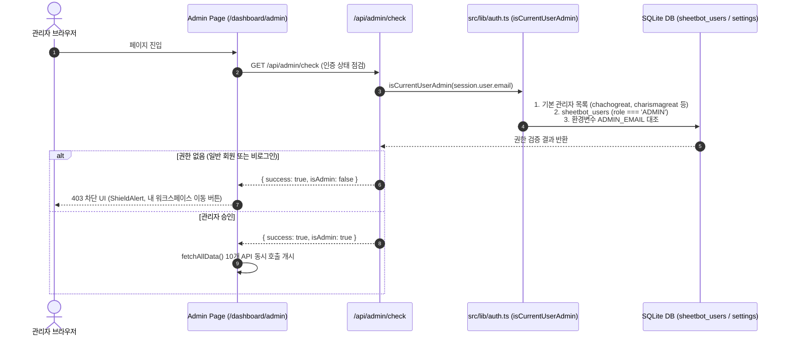

# SheetBot 통합 운영 관리 센터 (Admin Console) 구조 및 최적화 진단 보고서

> **문서 버전:** 1.0.0  
> **기준 일자:** 2026-09-22  
> **대상 경로:** `src/app/dashboard/admin/page.tsx` 및 관련 하위 컴포넌트·백엔드 API 전체  
> **작성 목적:** 관리자 콘솔의 현재 사이트 구조 및 데이터 흐름을 체계적으로 정리하고, 향후 성능 최적화 작업을 위한 아키텍처 진단표를 제공합니다.

---

## 1. 개요 및 화면 목적

**통합 운영 관리 센터 (Admin Console, `/dashboard/admin`)**는 SheetBot의 전체 시스템 현황, 회원 관리, 매출/토큰 지갑, 1:1 고객 문의, Enterprise AX 수주 파이프라인, 푸터 및 알림 인프라를 총괄하는 일체형 마스터 백오피스입니다.

- **접근 URL:** `/dashboard/admin` (파라미터: `?tab={tabKey}`)
- **권한 제어:** NextAuth Google 세션 기반 관리자 검증 (`isCurrentUserAdmin`)
- **실시간 탭 연동:** URL 쿼리스트링 및 SheetBot AI 챗봇의 커스텀 이벤트(`sheetbot_switch_admin_tab`)를 통한 탭 전환 지원

---

## 2. 접근 제어 및 보안 아키텍처



---

## 3. 프론트엔드 컴포넌트 계층 구조

관리자 콘솔 메인 페이지(`page.tsx`, 49KB, 1,254 라인)가 모든 하위 탭 컴포넌트와 상태를 직접 들고 있으며, 총 12개의 업무별 탭 컴포넌트로 분할 구성되어 있습니다.

```
src/app/dashboard/admin/
├── page.tsx                           # [메인 조종석] 상태 중앙 집중 관리, 12개 탭 라우팅, KPI 지표 (49KB)
└── components/
    ├── AdminUsersTab.tsx              # [탭 1] 회원 계정/토큰/등급/정지 관리 (27KB, 604L)
    ├── AdminInquiriesTab.tsx          # [탭 2] 1:1 문의 / Enterprise AX 수주 / FDE 지원 관리 (95KB, 1,845L)
    │   ├── AdminProposalModal.tsx     # └─ 기업 맞춤 AX 견적·제안서 모달 (53KB, 1,180L)
    │   └── AdminVocAnalyticsSection.tsx # └─ VoC 감성/키워드 분석 대시보드 (19KB, 450L)
    ├── AdminReviewsTab.tsx            # [탭 3] 사용자 후기 승인/노출 관리 (6KB, 172L)
    ├── AdminFaqsTab.tsx               # [탭 4] FAQ 카테고리/Q&A CRUD 편집 (10KB, 260L)
    ├── AdminTaxInvoicesTab.tsx        # [탭 5] 세금계산서/현금영수증 발행 요청 대장 (6KB, 170L)
    ├── AdminPricingCostTab.tsx        # [탭 6] AI 모델별 실제 원가/판매가/마진율 관제 (41KB, 890L)
    ├── AdminFooterTab.tsx             # [탭 7] 푸터 사업자 정보 / CS 시간 / SNS 링크 설정 (34KB, 780L)
    ├── AdminSmsTab.tsx                # [탭 8] 구글메시지 SMS 발송 설정 / 안드로이드 기기 연동 (30KB, 680L)
    ├── AdminEmailTab.tsx              # [탭 9] 발송 메일 SMTP 설정 및 테스트 발송 (11KB, 290L)
    ├── AdminSmartRulesTab.tsx         # [탭 10] AI 자연어 기반 스마트 알림 발송 규칙 (10KB, 280L)
    ├── AdminDispatchLogsTab.tsx       # [탭 11] SMS/이메일 알림 발송 이력 대장 (21KB, 490L)
    └── AdminPromptsTab.tsx            # [탭 12] 대시보드 추천 프롬프트 갤러리 관리 (29KB, 620L)
```

---

## 4. 12대 관리 탭 상세 명세

| 탭 식별자 (`activeTab`) | 탭 명칭 | 핵심 기능 | 연동 백엔드 API |
| :--- | :--- | :--- | :--- |
| `users` | **회원 계정 관리** | 회원 검색, 등급 필터(FREE/PRO/ENTERPRISE), 토큰 수동 지급/차감, 계정 상태(ACTIVE/SUSPENDED) 토글, 관리자 메모 | `/api/admin/users`<br/>`/api/admin/users/tokens` |
| `inquiries` | **1:1 고객 문의 & AX 수주** | 일반 문의 및 기업 AX 견적 접수, AI 리드 스코어링(Tier S/A), AI 자동 답변 초안(`ai-draft`), AI 바우처 매칭(`ai-analyze`), 견적서 모달 | `/api/admin/inquiries`<br/>`/api/admin/inquiries/reply`<br/>`/api/admin/inquiries/ai-draft`<br/>`/api/admin/inquiries/ai-analyze`<br/>`/api/admin/inquiries/voc-analytics` |
| `reviews` | **사용 후기 관리** | 고객 후기 승인/미승인 토글, 평점(1~5점) 집계 및 노출 통제 | `/api/admin/reviews` |
| `faqs` | **FAQ 항목 편집** | 질문/답변 추가·수정·삭제, 정렬 순서 및 카테고리 통제 | `/api/admin/faqs` |
| `tax_invoices` | **세금계산서 발행 대장** | 무통장 입금 회원의 세금계산서/현금영수증 요청 승인, 사업자등록번호 확인 | `/api/admin/tax-invoices` |
| `pricing_cost` | **AI 원가 & 마진율 관제** | Gemini Flash/Pro 등 모델별 토큰 매입원가, 판매단가, 마진율 시뮬레이션 및 설정 | `/api/admin/pricing-cost`<br/>`/api/admin/ai-usage` |
| `footer` | **푸터 / 회사정보 & SNS** | 상호, 대표자, 사업자번호, 통신판매업, 주소, CS 운영시간, 유튜브/인스타/블로그 링크 | `/api/admin/footer` |
| `sms` | **구글메시지 SMS 알림** | SheetBot Agent 스마트폰 기기 연결 상태 점검, QR 페어링, 테스트 SMS 발송 | `/api/admin/sms`<br/>`/api/admin/sms/test`<br/>`/api/admin/sms/check`<br/>`/api/admin/sms/devices` |
| `email` | **발송 메일 SMTP 설정** | SMTP 호스트, 포트, 인증 계정, 앱 비밀번호 저장 및 즉시 테스트 메일 발송 | `/api/admin/email`<br/>`/api/admin/email/test` |
| `smart_rules` | **AI 자연어 발송 규칙** | "새 문의 등록 시 관리자에게 문자 전송" 등 자연어 프롬프트를 파싱하여 이벤트 트리거 규칙 등록 | `/api/admin/smart-rules` |
| `dispatch_logs` | **알림 발송 이력 대장** | 채널별(SMS/EMAIL), 상태별(SUCCESS/FAILED) 알림 발송 기록 실시간 조회 및 통계 | `/api/admin/dispatch-logs` |
| `prompts` | **추천 프롬프트 관리** | 회원 대시보드 및 랜딩에 노출되는 추천 프롬프트 카테고리별 CRUD 관리 | `/api/admin/prompts` |

---

## 5. 백엔드 API 엔드포인트 맵 (총 29개 라우트)

```
src/app/api/admin/
├── check/route.ts                     # GET: 관리자 권한 여부 확인
├── users/
│   ├── route.ts                       # GET: 전체 회원 통계 결합 목록 / PUT: 회원 상태·등급 수정
│   └── tokens/route.ts                # POST: 회원 토큰 수동 지급 및 차감
├── inquiries/
│   ├── route.ts                       # GET: 문의 목록 / POST: 문의 등록 / PUT: 상태 변경 / DELETE: 삭제
│   ├── reply/route.ts                 # POST: 답변 등록 및 이메일/SMS 알림 발송
│   ├── ai-draft/route.ts              # POST: Gemini AI 문의 답변 초안 자동 생성
│   ├── ai-analyze/route.ts            # POST: AI 기업정보 분석 및 바우처 매칭
│   ├── voc-analytics/route.ts         # GET: VoC 감성 분석 및 주요 키워드 집계
│   └── company-candidates/route.ts    # GET: 기업명 자동완성 후보 조회
├── proposal/
│   └── edit/route.ts                  # POST: 맞춤형 AX 제안서 데이터 편집 및 저장
├── reviews/route.ts                   # GET: 후기 목록 / PUT: 노출 상태 토글 / DELETE: 후기 삭제
├── faqs/route.ts                      # GET: FAQ 목록 / POST: 신규 등록 / PUT: 수정 / DELETE: 삭제
├── tax-invoices/route.ts              # GET: 세금계산서 목록 / PUT: 상태 변경(발행완료/반려)
├── pricing-cost/route.ts              # GET: AI 원가 설정 조회 / POST: AI 원가 및 마진율 업데이트
├── ai-usage/route.ts                  # GET: 플랫폼 전체 AI 토큰 사용 통계
├── footer/route.ts                    # GET: 푸터 정보 조회 / POST: 푸터 정보 저장
├── sms/
│   ├── route.ts                       # GET: SMS 설정 및 기기 목록 / POST: 설정 저장
│   ├── check/route.ts                 # POST: 스마트폰 기기 연결 상태 실시간 핑 점검
│   ├── test/route.ts                  # POST: 테스트 SMS 즉시 발송
│   └── devices/route.ts               # POST: 기기 추가 / PUT: QR 페어링 실행 / DELETE: 기기 삭제
├── email/
│   ├── route.ts                       # GET: SMTP 설정 조회 / POST: SMTP 설정 저장
│   └── test/route.ts                  # POST: 테스트 이메일 즉시 발송
├── smart-rules/route.ts               # GET: 규칙 목록 / POST: 자연어 규칙 생성 / PUT: 토글 / DELETE: 삭제
├── dispatch-logs/route.ts             # GET: 발송 이력 검색·필터 조회 / DELETE: 로그 삭제
├── prompts/route.ts                   # GET: 프롬프트 목록 / POST: 등록 / PUT: 수정 / DELETE: 삭제
├── settings/route.ts                  # GET/POST: 공통 관리자 시스템 설정
├── monitor/
│   ├── poll/route.ts                  # GET: 실시간 운영 지표 폴링
│   └── briefing/route.ts              # GET: AI 아침 운영 브리핑 요약
└── migrate/route.ts                   # POST: 전체 DB 스키마 점검 및 관리자 승격 마이그레이션 실행
```

---

## 6. 데이터베이스 테이블 연동 구조

| 물리 테이블명 | 논리 명칭 | 담당 탭 | 주요 컬럼 |
| :--- | :--- | :--- | :--- |
| `sheetbot_users` | 회원 계정 및 권한 대장 | `users` | email, name, role(ADMIN/USER), tier(FREE/PRO/ENTERPRISE), status, note |
| `sheetbot_user_wallets` | 회원별 토큰 지갑 | `users` | user_email, balance_tokens, total_purchased_tokens, total_used_tokens |
| `sheetbot_inquiries` | 1:1 고객 문의 및 B2B 리드 | `inquiries` | user_email, title, content, category, status, ai_score, ai_company_analysis |
| `sheetbot_reviews` | 고객 사용 후기 | `reviews` | user_name, user_email, rating, content, is_published |
| `sheetbot_faqs` | 자주 묻는 질문(FAQ) | `faqs` | category, question, answer, display_order |
| `sheetbot_tax_invoices` | 세금계산서/현금영수증 신청 | `tax_invoices` | user_email, business_number, company_name, amount, status |
| `sheetbot_settings` | 플랫폼 통합 JSON 설정 | `footer`, `sms`, `email`, `pricing_cost` | key(`sheetbot_footer_settings`, `sheetbot_sms_settings` 등), value(JSON) |
| `sheetbot_user_devices` | SMS 발송 안드로이드 기기 | `sms` | device_id, label, status, user_email |
| `smart_dispatch_rules` | AI 자연어 발송 규칙 | `smart_rules` | name, event_trigger, channel, target_type, template, enabled |
| `sheetbot_dispatch_logs` | 알림 발송 이력 | `dispatch_logs` | channel(SMS/EMAIL), recipient, title, status(SUCCESS/FAILED), error_msg |
| `sheetbot_prompts_gallery`| 추천 프롬프트 갤러리 | `prompts` | category, title, description, prompt_text, tags, likes_count |

---

## 7. 현재 구조의 성능 병목 및 최적화 포인트 8대 진단

현재 코드를 수정하지 않고 구조를 분석한 결과, 다음 8가지 주요 성능 병목 지점이 확인되었습니다. 향후 최적화 시 이 항목들을 순차적으로 개선해야 합니다.

### 🔴 1. 페이지 진입 시 10개 API 동시 무조건 호출 (Massive Waterfall Fetching)
- **현상:** 관리자 인증 통과 즉시 `fetchAllData()`에서 `users`, `inquiries`, `reviews`, `faqs`, `tax-invoices`, `footer`, `sms`, `email`, `smart-rules`, `dispatch-logs` 10개의 API를 `Promise.all`로 일괄 호출합니다.
- **문제점:** 사용자가 첫 화면인 `users` 탭만 보려고 해도 수십 KB~수백 KB에 달하는 다른 9개 탭의 전체 데이터를 불필요하게 동시에 다운로드하여 초기 로딩(TTI)이 매우 지연됩니다.
- **최적화 방향:** **탭별 지연 로딩(Lazy Fetching on Demand)** 적용. 현재 활성화된 탭(`activeTab`)의 데이터만 우선 호출하고, 탭 이동 시 해당 탭의 데이터를 온디맨드로 패칭.

### 🔴 2. 거대한 번들 사이즈와 동적 임포트(Code Splitting) 부재
- **현상:** `AdminDashboardPage` 단일 파일(49KB) 상단에 12개의 모든 탭 컴포넌트(합계 400KB 이상)가 정적 `import`로 선언되어 있습니다.
- **문제점:** `AdminInquiriesTab`(95KB), `AdminProposalModal`(53KB), `AdminPricingCostTab`(41KB), `AdminFooterTab`(34KB) 등이 첫 방문 시 한 번에 다운로드되어 자바스크립트 번들이 비대해집니다.
- **최적화 방향:** `next/dynamic` 또는 `React.lazy`를 활용하여 탭 컴포넌트들을 비동기 코드 분할(Dynamic Import with Suspense) 처리.

### 🔴 3. 백엔드 N+1 풀스캔 및 Node.js 메모리 결합 (`/api/admin/users`)
- **현상:** `/api/admin/users/route.ts`에서 5개 테이블(`sheetbot_user_wallets`, `sheetbot_users`, `sheetbot_projects`, `sheetbot_payment_orders`, `sheetbot_inquiries`)의 전체 행(limit 500)을 각각 긁어와 Node.js 메모리 상에서 이중 반복문과 filter/find/reduce로 조인합니다.
- **문제점:** 회원 수와 결제 이력, 프로젝트가 누적될수록 선형적으로 백엔드 응답 속도가 급격히 저하됩니다.
- **최적화 방향:** 단일 SQL `JOIN` 또는 필요한 집계 컬럼만 그룹화하여 조회하도록 쿼리 구조 개선, 캐싱 도입.

### 🔴 4. 서버 사이드 페이지네이션 부재 (Client-Side Full Rendering)
- **현상:** `users`, `inquiries`, `dispatch-logs`, `tax-invoices` 등 계속 증가하는 대장 데이터가 전체 배열 형태로 클라이언트에 전송된 후 프론트엔드에서 필터링 및 렌더링됩니다.
- **문제점:** 데이터가 수백~수천 건으로 늘어나면 DOM 노드 증가로 인해 브라우저 렌더링 렉 및 메모리 누수 발생.
- **최적화 방향:** 백엔드 API에 `page`, `limit`, `search`, `status` 쿼리 파라미터를 추가하여 **서버 사이드 페이지네이션**으로 전환.

### 🔴 5. 부모 컴포넌트의 과도한 상태 집중으로 인한 전체 리렌더링 (State Explosion)
- **현상:** 10개 탭의 모든 폼 입력 상태(SMS 설정, SMTP 비밀번호 토글, 발송 로그 필터 등)와 핸들러가 부모인 `page.tsx`에 선언되어 Props로 전달됩니다.
- **문제점:** 하위 탭에서 텍스트 하나를 입력하거나 상태를 변경할 때마다 최상위 `AdminDashboardPage`가 리렌더링되어 전체 UI가 불필요하게 다시 계산됩니다.
- **최적화 방향:** 각 탭 내부에서만 사용되는 상태(예: SMS 테스트 번호, SMTP 비밀번호 노출 여부, 검색 인풋 등)는 해당 하위 컴포넌트 내부 상태로 캡슐화(Colocation).

### 🔴 6. 서버 상태 캐싱(SWR / TanStack Query) 부재
- **현상:** 데이터를 조회할 때마다 순수 `apiFetch` 함수를 호출하고 컴포넌트 로컬 상태에 저장합니다.
- **문제점:** 탭을 전환하거나 다른 페이지를 다녀올 때마다 캐시 없이 매번 전체 API를 새로 호출하며, 중복 요청 방지(Deduplication) 및 백그라운드 갱신(Revalidation)이 지원되지 않습니다.
- **최적화 방향:** SWR 또는 TanStack Query(React Query)를 도입하여 탭별 데이터 캐싱, 중복 요청 제거, 백그라운드 자동 갱신 구조 구축.

### 🔴 7. 매 요청 시 `setupDatabase()` 안전성 점검 비용
- **현상:** 거의 모든 관리자 라우트 핸들러 상단에서 `await setupDatabase()`가 명시적으로 실행됩니다.
- **문제점:** `quickCheck` 가드가 추가되어 단축되었으나, 분기마다 불필요한 테이블 체크 쿼리가 1회씩 동반됩니다.
- **최적화 방향:** 서버 기동 시 최초 1회 초기화 후, 후속 요청에서는 전역 싱글톤 플래그로 쿼리 없이 즉시 바이패스되도록 경량화.

### 🔴 8. 대형 모달 및 서브 섹션의 인라인 분리
- **현상:** `AdminInquiriesTab.tsx`는 1,845라인(95KB)으로, 상세 보기, AI 초안 생성 모달, 답변 발송 폼, 지원자 카드 등 다양한 서브 뷰가 단일 파일에 밀집되어 있습니다.
- **문제점:** 코드 가독성과 유지보수성이 떨어지고 디버깅 시 재렌더링 범위가 넓어집니다.
- **최적화 방향:** `InquiryCard`, `InquiryDetailDrawer`, `InquiryReplyModal` 등으로 단위 분할 모듈화.

---

## 8. 최적화 단계별 로드맵 (제안)

```
[Phase 1: 즉각적 체감 성능 개선 (Quick Win)]
 ├─ 1. fetchAllData() 일괄 호출 제거 -> 탭 진입 시점에만 호출하는 On-Demand 지연 로딩 적용
 └─ 2. React.lazy / next/dynamic 기반 탭 컴포넌트 비동기 코드 분할 (번들 크기 70% 감소)

[Phase 2: 상태 관리 및 리렌더링 캡슐화]
 ├─ 1. page.tsx에 집중된 탭 전용 상태들을 개별 컴포넌트 내부로 이동
 └─ 2. 상단 5대 KPI 지표 전용 경량 요약 API (/api/admin/stats) 신설 (초기 헤더 렌더링 0.1초 달성)

[Phase 3: 백엔드 쿼리 및 페이지네이션 최적화]
 ├─ 1. /api/admin/users의 인-메모리 5중 풀스캔 조인을 단일 최적화 쿼리로 개편
 └─ 2. 발송 로그(dispatch-logs), 문의 대장(inquiries), 회원 대장(users) 서버 페이지네이션 구현
```
