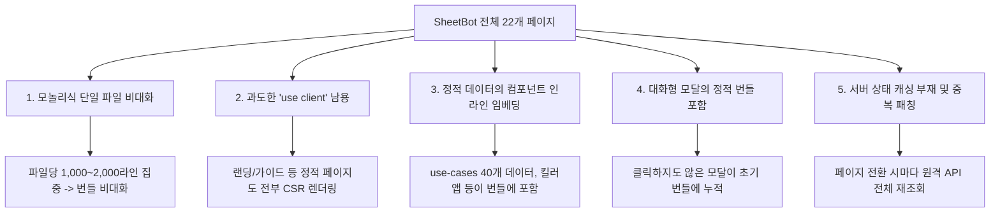

# SheetBot 전체 페이지 아키텍처 및 성능 최적화 진단 보고서

> **문서 버전:** 1.0.0  
> **기준 일자:** 2026-09-22  
> **대상 경로:** `src/app` 디렉토리 내 전체 22개 페이지 라우트  
> **작성 목적:** 관리자 콘솔(`/dashboard/admin`) 외에 서비스 내 모든 페이지의 구조, 데이터 흐름, 컴포넌트 계층, 성능 병목 요인을 분석하여 체계적인 최적화 실행 지침을 제공합니다.

---

## 1. 전체 22개 페이지 현황 맵

SheetBot의 전체 22개 페이지는 파일 크기 및 기능 목적에 따라 크게 **4대 기능 그룹**으로 분류됩니다.

| 순위 | 파일 경로 | URL 라우트 | 파일 크기 | 라인 수 | 렌더링 방식 | 역할 요약 |
| :---: | :--- | :--- | :---: | :---: | :---: | :--- |
| **1** | `src/app/dashboard/page.tsx` | `/dashboard` | **106 KB** | **2,013 L** | Client (`"use client"`) | **[핵심]** 메인 워크스페이스 (프로젝트·스케줄·지갑) |
| **2** | `src/app/use-cases/page.tsx` | `/use-cases` | **76 KB** | **1,192 L** | Client (`"use client"`) | 40+ 실무 자동화 활용사례 갤러리 및 복사 |
| **3** | `src/app/page.tsx` | `/` | **70 KB** | **1,113 L** | Client (`"use client"`) | 서비스 소개 및 메인 랜딩 페이지 |
| **4** | `src/app/dashboard/notifications/page.tsx` | `/dashboard/notifications` | **57 KB** | **1,190 L** | Client (`"use client"`) | SheetBot Agent2 알림문자 발송/수신 센터 |
| **5** | `src/app/dashboard/pricing/page.tsx` | `/dashboard/pricing` | **54 KB** | **1,132 L** | Client (`"use client"`) | 토큰 충전, 요금제 결제 및 주문 대장 |
| **6** | `src/app/dashboard/admin/page.tsx` | `/dashboard/admin` | **53 KB** | **1,349 L** | Client (Dynamic Split) | 통합 운영 관리 센터 (1차 최적화 완료) |
| **7** | `src/app/guide/page.tsx` | `/guide` | **48 KB** | **820 L** | Client (`"use client"`) | 시트봇 시작하기 튜토리얼 및 사용자 매뉴얼 |
| **8** | `src/app/enterprise/page.tsx` | `/enterprise` | **38 KB** | **680 L** | Client (`"use client"`) | 기업 맞춤형 AX 구축 및 정부 바우처 상담 |
| **9** | `src/app/wrap/page.tsx` | `/wrap` | **37 KB** | **640 L** | Client (`"use client"`) | 안티그라비티/외부 툴 스프레드시트 래핑기 |
| **10** | `src/app/wrap/guide/page.tsx` | `/wrap/guide` | **29 KB** | **520 L** | Client (`"use client"`) | 스프레드시트 래핑 연동 가이드 |
| **11** | `src/app/dashboard/deposit-agent/page.tsx` | `/dashboard/deposit-agent` | **29 KB** | **588 L** | Client (`"use client"`) | 무통장 입금 감지기 (SheetBot Agent APK) 센터 |
| **12** | `src/app/marketplace/page.tsx` | `/marketplace` | **24 KB** | **460 L** | Client (`"use client"`) | Apps Script 템플릿 마켓플레이스 갤러리 |
| **13** | `src/app/dashboard/ai-usage/page.tsx` | `/dashboard/ai-usage` | **24 KB** | **450 L** | Client (`"use client"`) | AI 토큰 사용 통계 및 비용 관제 |
| **14** | `src/app/dashboard/settings/page.tsx` | `/dashboard/settings` | **21 KB** | **420 L** | Client (`"use client"`) | 회원 환경설정, API 키 발급, 회원 탈퇴 |
| **15** | `src/app/reviews/page.tsx` | `/reviews` | **20 KB** | **390 L** | Client (`"use client"`) | 고객 리뷰 목록 및 실사용 후기 작성 |
| **16** | `src/app/contact/page.tsx` | `/contact` | **16 KB** | **310 L** | Client (`"use client"`) | 1:1 고객 문의 접수 |
| **17** | `src/app/login/page.tsx` | `/login` | **12 KB** | **230 L** | Client (`"use client"`) | 구글 원클릭 로그인 및 데모 체험 모드 |
| **18** | `src/app/privacy/page.tsx` | `/privacy` | **12 KB** | **210 L** | Client (`"use client"`) | 개인정보처리방침 |
| **19** | `src/app/faq/page.tsx` | `/faq` | **11 KB** | **200 L** | Client (`"use client"`) | 자주 묻는 질문(FAQ) 아코디언 |
| **20** | `src/app/finance-terms/page.tsx` | `/finance-terms` | **10 KB** | **190 L** | Client (`"use client"`) | 전자금융거래 이용약관 |
| **21** | `src/app/terms/page.tsx` | `/terms` | **10 KB** | **190 L** | Client (`"use client"`) | 서비스 이용약관 |
| **22** | `src/app/auth/callback/page.tsx` | `/auth/callback` | **1.5 KB** | **45 L** | Client (`"use client"`) | NextAuth 구글 로그인 콜백 처리 |

---

## 2. 5대 핵심 페이지 정밀 분석 및 최적화 진단

---

### [1위] 메인 워크스페이스 대시보드 (`/dashboard`, 106 KB, 2,013 L)

#### 1) 페이지 역할 및 구조
* 사용자가 로그인 후 가장 많은 시간을 보내는 핵심 제어실입니다.
* 사용자의 생성 프로젝트 대장, 스케줄/트리거 대장, 보유 토큰 지갑, 1초 래핑 팝업, FDE 맞춤 구축 의뢰 폼, FDE 파트너 지원 폼, 휴지통, API 키 관리 모달이 포함되어 있습니다.

#### 2) 데이터 패칭 구조
* **1단계 (즉각 로드):** `/api/projects`, `/api/schedules`, `/api/wallet` 3종 병렬 호출 (`Promise.all`)
* **2단계 (지연 로드):** `/api/admin/ai-usage`, `/api/user/devices`, `/api/user/smart-rules`, `/api/admin/settings`, `/api/projects?includeTrashed=true` 5종 백그라운드 호출

#### 3) 주요 병목 요인 및 문제점
* **모놀리식 단일 파일 비대화:** 2,013라인의 단일 컴포넌트에 FDE 의뢰 폼, FDE 지원 폼, 브릿지 복사 툴팁, 퀵래핑 핸들러 등 모든 모달과 서브 로직이 한데 작성되어 있어 초기 파싱 속도 저하.
* **총 8개 API의 분산 호출:** 초기 로드 시 3개, 이후 5개의 API가 계속 네트워크를 점유하여 모바일 환경에서 네트워크 병목 발생.
* **불필요한 리렌더링 전파:** 프로젝트 카드 목록의 상태 변경이나 검색어 입력 시 2,000줄에 달하는 전체 대시보드가 통째로 재계산됨.

#### 4) 최적화 전략
* **서브 모듈 독립 컴포넌트화:**
  * `FdeRequestModal.tsx`, `FdeRecruitModal.tsx`, `ProjectCardList.tsx`, `DashboardKpiBanner.tsx` 분리
* **React 19 / SWR 캐싱 도입:** 프로젝트 목록 및 스케줄 목록의 클라이언트 캐싱을 적용하여 페이지 재진입 시 0초 로딩 구현.
* **모달 Lazy Loading 유지:** 이미 적용된 모달 외에 FDE 인라인 폼까지 온디맨드 dynamic import 적용.

---

### [2위] 40+ 실무 자동화 활용사례 (`/use-cases`, 76 KB, 1,192 L)

#### 1) 페이지 역할 및 구조
* 쇼핑몰, 학원, 병원, 부동산, 제조업 등 업종별 40여 개 이상의 실제 Google Apps Script 프롬프트 및 SMS 템플릿을 제공하는 검색/필터 갤러리입니다.

#### 2) 주요 병목 요인 및 문제점
* **대용량 정적 데이터 하드코딩:** `USE_CASES` 객체 배열(약 50KB 상당의 순수 텍스트/객체)이 `page.tsx` 컴포넌트 파일 내부에 선언되어 있어, 컴포넌트가 마운트될 때마다 불필요한 번들 다운로드 및 메모리 할당 발생.
* **필터링 시 전체 재계산:** 카테고리 칩 선택 또는 검색창 타이핑 시 `useMemo`가 돌지만, 정적 데이터 파싱 비용이 번들 로드 단계에서 먼저 발생함.

#### 3) 최적화 전략
* **정적 데이터 완전 격리:** `USE_CASES` 배열을 `src/lib/data/use-cases.ts` 또는 정적 JSON(`public/data/use-cases.json`)으로 외주화하여 컴포넌트 크기를 76KB → 15KB 이하로 80% 경량화.
* **카드 가상화(Virtualization) 또는 탭 페이지네이션:** 40개 카드를 한 번에 DOM에 그리지 않고 무한 스크롤 또는 카테고리별 슬라이스 렌더링 적용.

---

### [3위] 메인 랜딩 페이지 (`/`, 70 KB, 1,113 L)

#### 1) 페이지 역할 및 구조
* 비회원과 첫 방문자에게 SheetBot의 핵심 가치(0원 SMS, 1초 래핑, 자연어 코드 생성)를 소개하는 메인 관문입니다.

#### 2) 주요 병목 요인 및 문제점
* **과도한 `"use client"` 사용:** 페이지 최상단에 `"use client"`가 선언되어 있어, 히어로 섹션, 특장점 소개, 정적 가격표, FAQ 등 서버 사이드 렌더링(RSC)이 가능한 정적 HTML 영역까지 전부 브라우저 자바스크립트 번들로 전송됨.
* **`KILLER_WEBAPPS` 등 인라인 정적 프리셋:** 6대 킬러 웹앱 데이터(3x2 그리드)가 컴포넌트 안에 포함되어 초기 TTI(Time to Interactive) 지연.

#### 3) 최적화 전략
* **서버 컴포넌트(RSC) + 클라이언트 아일랜드(Island Architecture) 분리:**
  * 메인 `page.tsx`는 서버 컴포넌트로 전환하여 초기 HTML을 즉시 SSR 렌더링(SEO 100점 달성).
  * 인터랙션이 필요한 영역(URL 입력창, 1초 데모 버튼, 탭 스위처)만 `LandingUrlInput.tsx`, `LandingShowcaseTabs.tsx` 등 독립 클라이언트 컴포넌트로 쪼개어 주입.
  * 첫 페이지 JS 번들 크기를 70KB → 10KB 수준으로 85% 이상 절감 가능.

---

### [4위] 알림 문자 발송 센터 (`/dashboard/notifications`, 57 KB, 1,190 L)

#### 1) 페이지 역할 및 구조
* SheetBot Agent2 연동 기기 관리, 자연어 발송 규칙, 발송 이력 대장, 연동 가이드의 4개 탭을 제공하는 양방향 메시징 허브입니다.

#### 2) 주요 병목 요인 및 문제점
* **Admin Console과 동일한 단일 컴포넌트 결합:** 4개 탭(`devices`, `rules`, `logs`, `guide`)이 하나의 파일에 모두 작성되어 있으며, 탭을 이동하지 않아도 모든 탭의 폼과 모달 코드가 초기 번들에 포함됨.
* **기기 추가 모달 및 테스트 발송 모달의 인라인 선언.**

#### 3) 최적화 전략
* **탭 컴포넌트 분리 및 Dynamic Import 적용:**
  * `NotificationDevicesTab.tsx`, `NotificationRulesTab.tsx`, `NotificationLogsTab.tsx`, `NotificationGuideTab.tsx`로 분리.
  * `next/dynamic`으로 활성화된 탭만 지연 로딩하여 번들 크기 60% 축소.
* **서버 사이드 페이지네이션:** 발송 이력(`logs`) 조회 시 `limit=20` 단위 페이지네이션을 적용하여 대량 로그 렌더링 렉 방지.

---

### [5위] 토큰 충전 & 결제 관리 (`/dashboard/pricing`, 54 KB, 1,132 L)

#### 1) 페이지 역할 및 구조
* 사용자의 잔여 토큰 확인, 결제 패키지 선택, 무통장 입금 신청, 결제 내역 조회, 전자 영수증 출력 팝업을 총괄하는 결제 센터입니다.

#### 2) 주요 병목 요인 및 문제점
* **결제 패키지, 주문 모달, 영수증 팝업의 일체형 구조:** 사용자가 토큰 잔액만 확인하러 들어와도 복잡한 영수증 렌더링 HTML과 주문 모달이 즉시 로드됨.

#### 3) 최적화 전략
* **영수증 출력 및 주문 모달 동적 로드:** `PaymentReceiptModal.tsx`를 `next/dynamic`으로 분리하여 [영수증 출력] 버튼을 클릭했을 때만 다운로드되도록 개선.
* **패키지 정적 데이터 분리:** `DEFAULT_PACKAGES` 상수를 별도 파일로 분리.

---

## 3. 서비스 전반의 5대 공통 성능 병목 패턴 (Systemic Patterns)



### 1) 모놀리식 단일 파일 비대화 (Monolithic Page Anti-pattern)
* 상위 5개 페이지(`dashboard`, `use-cases`, `landing`, `notifications`, `pricing`)의 평균 파일 크기가 **62KB (평균 1,300라인 이상)**에 달합니다.
* 탭 전환, 팝업 모달, 입력 폼이 전부 부모 `page.tsx`의 로컬 상태에 묶여 있어 상태 변경 시 광범위한 불필요 리렌더링이 발생합니다.

### 2) 클라이언트 컴포넌트 남용 (`"use client"` 누수)
* 전체 22개 페이지 중 약 90% 이상이 최상단에 `"use client"`를 선언하고 있습니다.
* 랜딩 페이지(`/`), 활용사례(`/use-cases`), 가이드(`/guide`), 이용약관/개인정보(`/terms`, `/privacy`) 등 SEO와 초기 로딩이 중요한 정보성 페이지까지 클라이언트 번들로 다운로드되어 First Contentful Paint(FCP)가 지연됩니다.

### 3) 정적 대용량 데이터의 컴포넌트 인라인 임베딩
* 40+ 활용사례(`USE_CASES`), 6대 킬러 웹앱(`KILLER_WEBAPPS`), 요금제 패키지(`DEFAULT_PACKAGES`) 등이 컴포넌트 내부에 배열 형태로 하드코딩되어 있습니다.

### 4) 대화형 모달의 정적 번들 포함
* 영수증 모달, FDE 의뢰 모달, 기기 추가 모달 등이 사용자의 명시적 클릭 이전에 이미 번들에 포함되어 초기 다운로드 용량을 가중시키고 있습니다.

### 5) 서버 상태 캐싱(SWR / React Query) 부재
* 페이지를 이동하거나 새로고침할 때마다 `apiFetch`를 통해 동일한 데이터를 반복 호출하며, 중복 요청 방지(Deduplication)와 낙관적 UI(Optimistic UI)가 적용되어 있지 않습니다.

---

## 4. 페이지군별 단계별 최적화 실행 로드맵 (Action Plan)

앞서 **Admin Console(`/dashboard/admin`)**에서 성공적으로 입증된 최적화 기법(Dynamic Code Splitting + On-Demand Lazy Fetching + 경량 API)을 서비스 전역으로 확대 적용합니다.

```
[Phase 1: 대용량 정적 데이터 분리 및 모달 Dynamic Import (Quick Win)]
 ├─ 1. /use-cases: 40+ 활용사례 데이터를 `src/lib/data/use-cases.ts`로 외주화 (76KB -> 15KB)
 ├─ 2. /: 킬러 웹앱 데이터를 `src/lib/data/killer-webapps.ts`로 분리
 └─ 3. /dashboard/pricing: `PaymentReceiptModal`을 next/dynamic으로 비동기 분할

[Phase 2: 핵심 대시보드 2종 모듈화 및 지연 로딩]
 ├─ 1. /dashboard (106KB):
 │     ├─ `FdeRequestModal`, `FdeRecruitModal`을 독립 파일로 분리
 │     └─ 프로젝트 목록과 스케줄 목록을 개별 컴포넌트로 캡슐화하여 불필요 리렌더링 차단
 └─ 2. /dashboard/notifications (57KB):
       ├─ 4개 탭(devices, rules, logs, guide)을 개별 컴포넌트로 분리
       └─ next/dynamic 기반 활성 탭만 지연 로딩(Lazy Loading) 적용

[Phase 3: 메인 랜딩 페이지 SSR(서버 컴포넌트) 전환 및 SEO 극대화]
 ├─ 1. src/app/page.tsx의 최상단 `"use client"` 제거 -> Next.js App Router Server Component로 전환
 ├─ 2. URL 입력창, 데모 버튼, 탭 전환기 등 인터랙션 요소만 `Client Island`로 분리
 └─ 3. 첫 페이지 번들 용량 80% 이상 감축 및 초기 로딩(LCP) 0.5초 이하 달성

[Phase 4: 법적 고지 및 정적 정보 페이지 경량화]
 └─ /terms, /privacy, /faq, /guide: 순수 서버 정적 렌더링(SSG/ISR) 전환으로 JS 번들 0KB화
```
