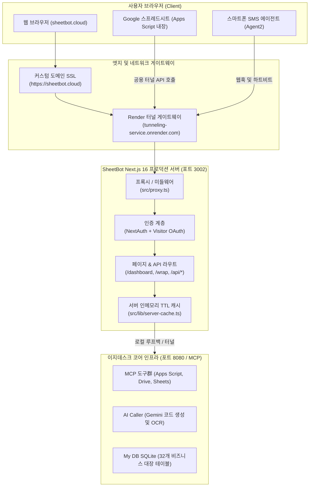
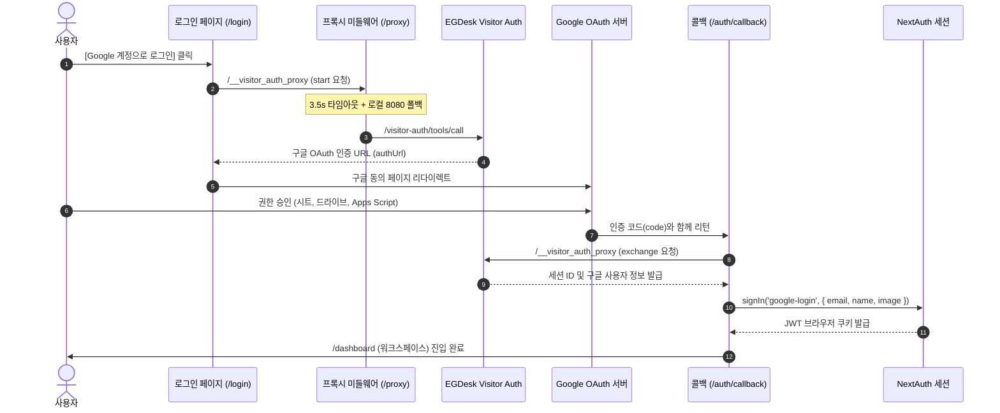
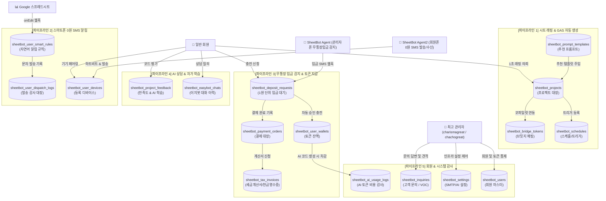

# SheetBot (시트봇) 🤖 시스템 아키텍처 및 종합 가이드

> **구글 스프레드시트와 스마트폰을 결합하는 AI 기반 Google Apps Script(GAS) 자동화 SaaS 플랫폼**  
> 운영 도메인: [https://sheetbot.cloud](https://sheetbot.cloud) | 운영 포트: `3002`

---

## 📋 목차
1. [프로젝트 개요 및 핵심 가치](#1-프로젝트-개요-및-핵심-가치)
2. [전체 시스템 아키텍처 다이어그램](#2-전체-시스템-아키텍처-다이어그램)
3. [인프라 및 배포 환경](#3-인프라-및-배포-환경)
4. [이원화 인증 및 세션 연동 구조](#4-이원화-인증-및-세션-연동-구조)
5. [역할 기반 권한 체계 (RBAC)](#5-역할-기반-권한-체계-rbac)
6. [핵심 기능 모듈 상세](#6-핵심-기능-모듈-상세)
7. [데이터베이스 설계 및 데이터 흐름도 (Data Flow)](#7-데이터베이스-설계-및-데이터-흐름도-data-flow)
8. [테이블별 상세 명세 및 데이터 흐름 매핑](#8-테이블별-상세-명세-및-데이터-흐름-매핑)
9. [디렉토리 및 핵심 파일 구조](#9-디렉토리-및-핵심-파일-구조)
10. [최근 트러블슈팅 이력 및 개선 로드맵](#10-최근-트러블슈팅-이력-및-개선-로드맵)

---

## 1. 프로젝트 개요 및 핵심 가치

SheetBot은 일반 비즈니스 사용자와 실무자가 코딩 없이도 복잡한 스프레드시트 업무를 자동화할 수 있도록 지원하는 All-in-One 자동화 솔루션입니다.

- **원클릭 스프레드시트 래핑**: 기존 구글 시트 URL만 입력하면 1초 만에 최적화된 Apps Script 코드를 자동 주입합니다.
- **AI 코파일럿 일체형 사이드바**: 시트 내에서 직접 동작하는 사이드바를 통해 토큰 잔액 조회, 충전, 안티그라비티 AI 자동화 연결을 제공합니다.
- **스마트폰 0원 양방향 알림 (SheetBot Agent2)**: 회원의 개인 스마트폰과 구글 시트를 연동하여 추가 비용(0원) 없이 SMS 알림 발송 및 수신 내역 자동 기록을 수행합니다.
- **다이렉트 무통장 입금 감지 (SheetBot Agent)**: 운영자 계좌의 입금 내역을 자동 감지하여 토큰을 즉시 충전합니다.

---

## 2. 전체 시스템 아키텍처 다이어그램



---

## 3. 인프라 및 배포 환경

### 1) 다중 포트 및 도메인 바인딩
- **운영 도메인**: `https://sheetbot.cloud` (Render Reverse Proxy 경유)
- **운영 서버 포트**: `3002` (`Next.js 16.2.6 Turbopack`)
- **로컬 개발 포트**: `4002` (`npm run dev`)
- **이지데스크 코어 포트**: `8080` (My DB 및 MCP 게이트웨이)
- **Visitor 인증 포트**: `54321` (Supabase 기반 로컬 OAuth 브로커)

### 2) 배포 파일 구조
- **개발 작업 소스**: `C:\dev\SheetBot`
- **로컬 빌드 아티팩트**: `C:\dev\SheetBot\.next\`
- **운영 런타임 배포본**: `C:\Users\CHARISMA\.egdesk\deployments\SheetBot\v{N}-{timestamp}\`
  - 무중단 배포를 위해 스냅샷 디렉토리를 격리 관리하며, `coding_start_server` 도구를 통해 버전 단위로 전환 구동됩니다.

---

## 4. 이원화 인증 및 세션 연동 구조

SheetBot은 구글 계정 보안과 Google Workspace 권한 획득을 위해 **2중 인증 파이프라인**을 운영합니다:



### 1) 인증 계층별 역할
1. **EGDesk Visitor OAuth (`egdesk-visitor-google.ts`)**:
   - 사용자의 구글 토큰을 안전하게 획득하여 시트 생성(`sheets_create_spreadsheet`), Apps Script 코드 주입(`apps_script_push_to_google`), 드라이브 연동에 활용.
2. **NextAuth.js (`src/lib/auth.ts`)**:
   - Next.js 서버 및 클라이언트 전역에서 `useSession()` 및 `getServerSession()`으로 로그인 여부와 사용자 이메일 식별.
3. **세션 동기화 (`src/components/SessionWrapper.tsx`)**:
   - 방문자 세션이 맺어지면 자동으로 NextAuth 세션으로 로그인시켜 양쪽 세션의 불일치를 방지.

---

## 5. 역할 기반 권한 체계 (RBAC)

SheetBot은 철저한 회원별 데이터 격리와 단 2명의 최고 관리자 계정 체계를 준수합니다.

### 1) 최고 관리자 (ADMIN)
- **지정 계정**:
  - `charismagreat@gmail.com`
  - `chachogreat@gmail.com`
- **권한 범위**:
  - `/dashboard/admin` 관리자 대시보드 전체 접근 허용
  - 회원 관리, 토큰 지급/회수, 결제 대장 및 세금계산서 승인
  - 시스템 SMTP 이메일 및 상용 SMS 게이트웨이 설정
  - 전역 프롬프트 템플릿 및 FAQ CRUD 제어

### 2) 일반 회원 (USER)
- **지정 계정**: 상기 2개 관리자 이메일을 제외한 모든 구글 로그인 계정
- **격리 원칙 (Multi-User Isolation)**:
  - 모든 프로젝트(`sheetbot_projects`), 스케줄(`sheetbot_schedules`), 스마트 규칙(`sheetbot_user_smart_rules`), 기기(`sheetbot_user_devices`) 쿼리는 반드시 현재 로그인된 세션 이메일(`user_email`)로 필터링됩니다.
  - 타 회원의 데이터는 절대 노출되거나 변경될 수 없습니다.

---

## 6. 핵심 기능 모듈 상세

| 기능 모듈 | 진입 경로 | 설명 |
| :--- | :--- | :--- |
| **스프레드시트 래핑** | `/wrap` | 구글 시트 URL을 입력받아 Apps Script 자동화 코드를 생성 및 배포 |
| **워크스페이스** | `/dashboard` | 보유 프로젝트 대장, 스케줄/트리거 제어, 토큰 잔액 조회 및 원클릭 실행 |
| **스마트 알림 센터** | `/dashboard/notifications` | 스마트폰(Agent2) 0원 문자 발송 규칙 설정 및 실시간 발송 로그 확인 |
| **무통장 입금 에이전트** | `/dashboard/deposit-agent` | 관리자 계좌 무통장 입금 감지 및 토큰 지갑 자동 충전 모니터링 |
| **토큰 충전 & 결제** | `/dashboard/pricing` | 토큰 요금제 확인, 무통장 송금 신청, 세금계산서/현금영수증 신청 |
| **관리자 대시보드** | `/dashboard/admin` | 12개 전문 관리 탭으로 구성된 플랫폼 전체 운영 조종석 |
| **자주 묻는 질문** | `/faq` | 45개 실무 FAQ 즉시 검색 및 카테고리별 가이드 제공 |
| **활용사례 갤러리** | `/use-cases` | 40+ 실무 업무 자동화 시나리오 및 적용 예시 안내 |

---

## 7. 데이터베이스 설계 및 데이터 흐름도 (Data Flow)

SheetBot은 **총 32개 테이블(My DB / SQLite)**을 기반으로 유기적으로 연결되어 있으며, 데이터는 **6대 핵심 비즈니스 파이프라인**을 따라 흐릅니다.

### 1) 데이터 흐름 종합 다이어그램


---

## 8. 테이블별 상세 명세 및 데이터 흐름 매핑

### [그룹 1] 프로젝트 및 시트 자동화 대장

| 테이블명 | 한글 명칭 | 주요 컬럼 | 사용 API / 컴포넌트 | 데이터 흐름 및 역할 |
| :--- | :--- | :--- | :--- | :--- |
| **`sheetbot_projects`** | 프로젝트 대장 | `id`, `user_email`, `spreadsheet_url`, `gas_project_id`, `script_code`, `bridge_token`, `status` | `/api/projects`, `/api/projects/quick-wrap`, `/dashboard/page.tsx` | 회원이 등록한 시트 래핑 정보 및 자동 생성된 Apps Script 소스코드 영구 보관 |
| **`sheetbot_schedules`** | 스케줄/트리거 대장 | `id`, `project_id`, `function_name`, `trigger_type`, `time_frequency`, `last_run_at`, `last_status` | `/api/schedules`, `ScheduleManager.tsx` | 분/일 단위 시간 트리거 및 `onEdit` 시트 수정 이벤트 실행 상태 추적 |
| **`sheetbot_bridge_tokens`** | 브릿지 토큰 대장 | `token`, `project_id`, `user_email`, `expires_at` | `/api/projects/bridge-token`, `/api/agent/gas-bridge` | 시트 내 AI 코파일럿과 외부 AI 에이전트 간의 1:1 비인증 터널 토큰 매핑 |
| **`sheetbot_prompt_templates`**| 추천 프롬프트 갤러리 | `category`, `title`, `prompt_text`, `tags`, `is_featured` | `/api/prompts`, `src/lib/setup-db.ts` | 웹앱 접수폼, 발주/재고 관리, AI OCR 등 실무 엄선 6대 킬러 프롬프트 프리셋 제공 |
| **`sheet_sync_configs`** | 시트 동기화 설정 | `sheet_id`, `sync_direction`, `target_table` | `/api/sheets/sqlite/*` | 구글 시트와 SQLite 테이블 간 양방향 데이터 미러링 규칙 저장 |

---

### [그룹 2] 스마트폰 SMS 0원 알림 (SheetBot Agent2)

| 테이블명 | 한글 명칭 | 주요 컬럼 | 사용 API / 컴포넌트 | 데이터 흐름 및 역할 |
| :--- | :--- | :--- | :--- | :--- |
| **`sheetbot_user_devices`** | 회원 디바이스 대장 | `id`, `user_email`, `device_id`, `phone_number`, `status`, `last_connected_at` | `/api/user/devices`, `/api/user/agent2/heartbeat`, `/notifications` | 회원의 스마트폰(`SheetBot Agent2`) 연결 상태 관리 및 60초 주기 하트비트 감지 |
| **`sheetbot_user_smart_rules`**| 자연어 알림 규칙 대장 | `user_email`, `project_id`, `prompt`, `trigger_event`, `recipient_column`, `message_template`, `is_active` | `/api/user/smart-rules`, `/api/webhooks/dispatch` | 시트 셀 변경 시 AI가 어떤 고객 연락처로 어떤 내용의 문자를 보낼지 정의한 규칙 대장 |
| **`sheetbot_user_dispatch_logs`**| 회원 알림 발송 이력 | `rule_id`, `device_id`, `recipient`, `content`, `status`, `error_message` | `/api/user/dispatch-logs` | 회원이 자신의 스마트폰을 통해 발송한 고객 문자 발송 성공/실패 내역 |
| **`sheetbot_dispatch_logs`** | 플랫폼 알림 발송 대장 | `channel`, `event_type`, `recipient_type`, `status` | `/api/admin/dispatch-logs`, `/api/admin/sms/test` | 관리자 알림(문의 접수, 무통장 입금 등) 및 전역 SMS/이메일 발송 감사 이력 |

---

### [그룹 3] 토큰 지갑 및 무통장 입금 감지 (SheetBot Agent)

| 테이블명 | 한글 명칭 | 주요 컬럼 | 사용 API / 컴포넌트 | 데이터 흐름 및 역할 |
| :--- | :--- | :--- | :--- | :--- |
| **`sheetbot_user_wallets`** | 회원 토큰 지갑 대장 | `user_email`, `balance_tokens`, `total_purchased_tokens`, `total_used_tokens`, `tier` | `src/lib/token-wallet.ts`, `/api/wallet` | 회원별 보유 AI 토큰 포인트 잔액 및 누적 충전/사용량 관리 (기본 10,000P 제공) |
| **`sheetbot_deposit_requests`**| 다이렉트 입금 대기 세션 | `deposit_code`, `depositor_name`, `amount_krw` (1원 단위 난수), `tokens_to_credit`, `status` | `/api/wallet/direct-deposit`, `/api/wallet/bank-webhook`, `/deposit-agent` | 동명이인 중복 방지를 위해 1~99원 난수 할인 금액(예: 4,987원)을 부여하고 입금 자동 매칭 |
| **`sheetbot_payment_orders`** | 토큰 결제 주문 대장 | `order_id`, `user_email`, `package_name`, `amount_krw`, `tokens_credited`, `status` | `/api/wallet`, `/dashboard/pricing` | 무통장 송금 완료 및 PG 결제 완료된 정규 결제 영수증 이력 |
| **`sheetbot_tax_invoices`** | 세금계산서 신청 대장 | `order_id`, `biz_number`, `company_name`, `manager_email`, `status` | `/api/wallet/tax-invoice`, `/api/admin/tax-invoices` | 사업자 회원의 세금계산서/현금영수증 발행 요청 및 관리자 발급 승인 처리 |

---

### [그룹 4] AI 인터랙션 & 피드백 & 엔터프라이즈

| 테이블명 | 한글 명칭 | 주요 컬럼 | 사용 API / 컴포넌트 | 데이터 흐름 및 역할 |
| :--- | :--- | :--- | :--- | :--- |
| **`sheetbot_easybot_chats`** | AI 대화 이력 대장 | `user_email`, `role` (user/bot), `message`, `action_chips` | `/api/easybot`, `/api/easybot/messages` | 이지봇(챗봇)과 나눈 자연어 Apps Script 문법/오류 해결 질의응답 이력 보관 |
| **`sheetbot_project_feedback`**| 프로젝트 만족도 대장 | `project_id`, `rating` (1~5), `satisfaction_type`, `comment`, `ai_learned` | `/api/feedback` | 코드 생성 결과에 대한 사용자 별점/피드백 수집 및 AI 자가 학습 반영 |
| **`sheetbot_inquiries`** | 고객 문의 대장 | `category`, `title`, `content`, `ai_draft`, `ai_score`, `answer` | `/api/inquiries`, `/api/admin/inquiries/*` | 1:1 고객 문의 접수 시 AI가 답변 초안(`ai_draft`)과 리드 점수를 사전 채점 |
| **`sheetbot_enterprise_inquiries`**| 기업 맞춤 AX 문의 | `company_name`, `phone`, `target_areas`, `candidate_profiles`, `ai_company_analysis` | `/api/enterprise/inquiry` | 경량 ERP 및 기업 전용 구축 문의 시 공공데이터(NPS) 기업 정보와 자동 결합 분석 |
| **`sheetbot_reviews`** | 서비스 사용 후기 | `rating`, `title`, `content`, `use_case`, `image_url` | `/api/reviews`, `src/app/page.tsx` | 랜딩 페이지에 노출되는 실제 고객의 생생한 업무 자동화 사용 후기 |

---

### [그룹 5] 회원 마스터 및 인프라 통제

| 테이블명 | 한글 명칭 | 주요 컬럼 | 사용 API / 컴포넌트 | 데이터 흐름 및 역할 |
| :--- | :--- | :--- | :--- | :--- |
| **`sheetbot_users`** | 회원 마스터 대장 | `email`, `role` (`USER`/`ADMIN`), `status`, `last_login_at`, `visitor_session_id` | `src/lib/auth.ts`, `/api/admin/users` | 회원 로그인 계정 식별 및 권한(`ADMIN` vs `USER`) 확인의 최우선 단일 원천 |
| **`sheetbot_user_api_keys`** | 개인 API 키 대장 | `user_email`, `api_key` (`sk_sheetbot_...`), `status`, `last_used_at` | `src/lib/api-keys.ts`, `/api/user/api-key` | 회원이 외부 CLI나 나만의 스크립트에서 SheetBot API를 호출할 때 사용하는 인증 키 |
| **`sheetbot_settings`** | 시스템 및 모델 설정 | `key`, `value`, `description` | `/api/admin/settings`, `/api/admin/sms`, `/api/admin/email` | 플랫폼 발송용 네이버 클라우드 SENS SMS 키, Gmail SMTP 설정, 기본 AI 모델명 등 저장 |
| **`sheetbot_ai_usage_logs`** | AI 사용료 감사 대장 | `caller`, `model`, `prompt_tokens`, `total_tokens`, `estimated_cost_krw` | `/api/admin/ai-usage`, `egdesk-helpers.ts` | 모든 Gemini LLM 호출 시 토큰 수와 환산 원화(KRW) 비용을 기록하여 과금 누수 차단 |
| **`sheetbot_faqs`** | FAQ 관리 대장 | `category`, `question`, `answer`, `sort_order` | `/api/faqs`, `/api/admin/faqs`, `/faq/page.tsx` | 45개 실무 FAQ 데이터를 보관하며 60초 TTL 인메모리 캐시로 초고속 서빙 |

---

## 9. 디렉토리 및 핵심 파일 구조

```
C:\dev\SheetBot\
├── README.md                      # [현재 파일] 프로젝트 종합 기술 문서
├── AGENTS.md                      # AI 어시스턴트 전용 개발 및 운영 규칙
├── next.config.ts                 # Next.js 환경 설정 및 basePath 제어
├── egdesk-helpers.ts              # 이지데스크 백엔드 통신 표준 라이브러리
├── egdesk-visitor-google.ts       # 구글 방문자 OAuth 브로커 헬퍼
├── src/
│   ├── proxy.ts                   # EGDesk MCP 프록시 미들웨어 (타임아웃 & 폴백)
│   ├── app/
│   │   ├── layout.tsx             # RootLayout & SessionProvider
│   │   ├── page.tsx               # 서비스 소개 랜딩 페이지
│   │   ├── login/page.tsx         # 구글 로그인 페이지 (2중 폴백 안전망)
│   │   ├── wrap/page.tsx          # 스프레드시트 1초 래핑 페이지
│   │   ├── dashboard/
│   │   │   ├── page.tsx           # 워크스페이스 대시보드
│   │   │   ├── admin/page.tsx     # 12개 탭 관리자 통합 제어 센터
│   │   │   ├── notifications/     # 스마트 알림 센터 (Agent2)
│   │   │   ├── deposit-agent/     # 무통장 입금 감지 에이전트
│   │   │   └── pricing/page.tsx   # 토큰 충전 및 결제
│   │   └── api/
│   │       ├── admin/             # 관리자 전용 API군 (check, stats, users 등)
│   │       ├── auth/              # 인증 API (NextAuth, login-start 등)
│   │       ├── faqs/              # FAQ 캐시 조회 API
│   │       ├── projects/          # 회원별 프로젝트 관리 API
│   │       ├── schedules/         # 스케줄/트리거 제어 API
│   │       └── wallet/            # 토큰 지갑 및 입금 API
│   ├── components/                # 재사용 UI 컴포넌트 모음
│   └── lib/
│       ├── auth.ts                # NextAuth 설정 및 관리자(ADMIN) 판별 로직
│       ├── server-cache.ts        # 인메모리 TTL 캐시 유틸
│       ├── setup-db.ts            # 안전한 테이블 생성 및 감사 컬럼 주입 헬퍼
│       └── token-wallet.ts        # 토큰 잔액 조회 및 트랜잭션 처리
```

---

## 10. 최근 트러블슈팅 이력 및 개선 로드맵

### 1) 해결된 주요 이슈
- [x] **FAQ 및 대시보드 3분 로딩 지연**: 매 요청마다 실행되던 무거운 DB 테이블 초기화(`setupDatabase()`) 제거 및 캐시/타임아웃 적용으로 해결.
- [x] **관리자 페이지 접근 차단 오류**: NextAuth 세션 이메일이 백엔드로 정상 전달되도록 쿼리 파라미터 및 헤더 파싱을 일원화하고, `ADMIN` 계정을 `charismagreat`, `chachogreat` 단 2명으로 엄격 격리.
- [x] **로그인 페이지 스피너 무한 멈춤**: 방문자 구글 인증 프록시 지연 시 4초 타임아웃 레이스를 통해 자체 `/api/auth/google/login-start`로 즉시 폴백하고 `isLoading`이 자동 해제되도록 안전망 구축.

### 2) 개발 및 운영 원칙 (재발 방지)
- **충분한 구조 분석 우선**: 오류 발생 시 임의의 임시 코드를 급조하지 않고, 호출 체인(브라우저 ➡️ 프록시 ➡️ 백엔드 ➡️ DB) 전체를 정밀 추적한 후 근본 원인을 해결합니다.
- **타임아웃 가드 필수**: 모든 비동기 네트워크 통신에는 반드시 3~5초 타임아웃 레이스를 기본 적용하여 브라우저 화면이 멈추는 현상을 원천 방지합니다.
- **운영/개발 환경 분리 인지**: 로컬 소스(`C:\dev\SheetBot`)와 EGDesk 배포 스냅샷(`deployments/v{N}`)의 동기화 상태를 철저히 검증하며 배포합니다.
- **⚡ [필수] 이지데스크 DB 왓처(DB Watcher) 사전 테스트 및 단계적 적용 원칙**:
  - 이지데스크 서버가 제공하는 DB 왓처(DB Watcher / 변경 감지 `/user-data/sse`) 기능을 서비스에 연동할 때는, **반드시 독립 테스트 환경(`scripts/test-db-watcher.mjs`)에서 사전 동작 검증(이벤트 수신 방식, 지연 시간, 프로토콜 규격)을 100% 완료한 후 프로덕션 코드에 적용**합니다.
  - 가설 기반의 임의 구현이나 외부 인프라 핑계를 지양하고, 브라우저 EventSource 규격과 서버 아키텍처(Node.js 런타임, `X-Accel-Buffering: no`, 단일 공유 업스트림 팬아웃, 15초 하트비트 핑)를 철저히 검증하여 안전하게 배포합니다.

### 3) 향후 개발 로드맵
- [x] **이지데스크 DB 왓처(DB Watcher) 독립 검증 및 무통장 입금 연동 완료**:
  - 이지데스크 서버 `/user-data/sse` 사전 실측 테스트 완료 (DB insert 시 0.05초 만에 `egdesk/user-data-changed` 수신 확인).
  - 브라우저 다중 탭 접속 시 연결 과부하를 방지하기 위해 서버 프로세스 내 **단일 공유 업스트림(Single Shared Upstream) 스트림 허브 (`DepositStreamHub`)** 아키텍처 적용.
  - Next.js 16 Node.js 런타임, `force-dynamic`, `X-Accel-Buffering: no`, `Cache-Control: no-cache, no-transform` 및 15초 하트비트 핑(`: ping\n\n`)을 통해 Nginx/프록시 유휴 차단 방지.
  - 관리자용 **`시트봇 에이전트 M` (`SheetBot Agent M`)** 대시보드 실시간 동기화 및 스트리밍 연결 뱃지 정상 연동.
- [ ] **관리자 이상 거래 푸시 알림**: 배터리 15% 이하 방전 위기 또는 미확인 금액 불일치 입금 시 대표님 텔레그램/슬랙 긴급 핫라인 연동.

