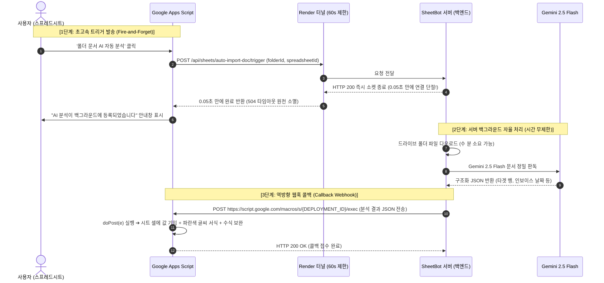

# SheetBot (시트봇) 🤖 시스템 아키텍처 및 종합 가이드

> **구글 스프레드시트와 스마트폰을 결합하는 AI 기반 Google Apps Script(GAS) 자동화 SaaS 플랫폼**  
> 운영 도메인: [https://sheetbot.cloud](https://sheetbot.cloud) | 운영 포트: `3005` (이지데스크 호스팅 기반)

---

## 📋 목차
1. [프로젝트 개요 및 핵심 가치](#1-프로젝트-개요-및-핵심-가치)
2. [전체 시스템 아키텍처 다이어그램](#2-전체-시스템-아키텍처-다이어그램)
3. [인프라 및 배포 환경](#3-인프라-및-배포-환경)
4. [이원화 인증 및 세션 연동 구조](#4-이원화-인증-및-세션-연동-구조)
5. [AI 무역/수입 수불부 자동화 및 문서 분류 시스템](#5-ai-무역수입-수불부-자동화-및-문서-분류-시스템)
6. [터널 60초 타임아웃(504) 극복과 웹훅/비동기 아키텍처](#6-터널-60초-타임아웃504-극복과-웹훅비동기-아키텍처)
7. [데이터베이스 설계 및 데이터 흐름도](#7-데이터베이스-설계-및-데이터-흐름도)
8. [디렉토리 및 핵심 파일 구조](#8-디렉토리-및-핵심-파일-구조)
9. [최근 트러블슈팅 이력 및 운영 원칙](#9-최근-트러블슈팅-이력-및-운영-원칙)

---

## 1. 프로젝트 개요 및 핵심 가치

SheetBot은 일반 비즈니스 사용자와 실무자가 복잡한 프로그래밍 지식 없이도 스프레드시트 업무를 완전 자동화할 수 있도록 지원하는 All-in-One 자동화 솔루션입니다.

- **원클릭 스프레드시트 래핑 (Wrap)**: 구글 시트 URL만 입력하면 1초 만에 최적화된 Apps Script 코드를 자동 주입합니다.
- **AI 코파일럿 일체형 사이드바**: 시트 내부에서 직접 구동되는 단일 통합 사이드바를 통해 토큰 잔액 조회, 즉시 충전, 실시간 AI 질의응답을 제공합니다.
- **AI 폴더 감시 및 무역 수불부 자동 기입**: 구글 드라이브 폴더에 송장(Commercial Invoice), 선하증권(B/L) 등의 문서를 올리면 AI가 문서를 자율 분석하여 적합한 탭(`SPRING`, `BAND`)의 일치하는 행을 찾아 인보이스 일자를 자동 기입하고 처리완료함으로 이동합니다.
- **스마트폰 0원 양방향 알림 (SheetBot Agent2)**: 회원의 개인 스마트폰과 구글 시트를 직결하여 통신사 부가비용 없이 SMS 알림 발송 및 회신 내역 자동 기록을 수행합니다.
- **무통장 입금 자동 감지 (SheetBot Agent M)**: 운영자 계좌의 입금 내역을 실시간 감지하여 회원 토큰을 즉시 자동 충전합니다.

---

## 2. 전체 시스템 아키텍처 다이어그램

```mermaid
flowchart TB
    subgraph Client["사용자 환경 (Workspace & Mobile)"]
        Browser["웹 브라우저 (sheetbot.cloud)"]
        GoogleSheet["Google 스프레드시트 (Apps Script 내장)"]
        DriveFolder["Google 드라이브 폴더 (신규 문서 적재)"]
        PhoneAgent["스마트폰 SMS/입금 에이전트"]
    end

    subgraph EdgeNetwork["엣지 및 네트워크 게이트웨이"]
        RenderGateway["Render 터널 게이트웨이\n(tunneling-service.onrender.com)"]
        CustomDomain["공식 도메인 SSL\n(https://sheetbot.cloud)"]
    end

    subgraph NextServer["SheetBot Next.js 16 프로덕션 서버 (포트 3005)"]
        NextProxy["프록시 / 미들웨어 (src/proxy.ts)"]
        AuthLayer["인증 계층 (Header Fast-Path + NextAuth)"]
        DocApi["AI 문서 분석 API (/api/sheets/auto-import-doc)"]
        AsyncWorker["백그라운드 비동기 워커 (Async Folder Worker)"]
    end

    subgraph EGDeskCore["이지데스크 코어 인프라 (포트 8080 / MCP)"]
        MCP_Tools["Workspace MCP (Sheets, Drive, Apps Script)"]
        AICaller["AI Caller (Gemini 2.5 Flash 추론 엔진)"]
        MyDB["My DB SQLite (32개 비즈니스 대장 테이블)"]
    end

    CustomDomain --> RenderGateway
    RenderGateway --> NextProxy
    GoogleSheet -->|0.5s 웹훅 신호| CustomDomain
    DriveFolder -.->|파일 동기화| GoogleSheet
    Browser --> CustomDomain
    PhoneAgent --> CustomDomain

    NextProxy --> AuthLayer
    AuthLayer --> DocApi
    DocApi -->|Fast-Return (0.5s)| GoogleSheet
    DocApi -->|비동기 위임| AsyncWorker
    AsyncWorker --> AICaller
    AsyncWorker --> MCP_Tools
    MCP_Tools -->|직접 시트 기입 & 파일 이동| GoogleSheet
    DocApi --> MyDB
```

---

## 3. 인프라 및 배포 환경

### 1) 다중 포트 및 도메인 바인딩
- **공식 운영 도메인**: `https://sheetbot.cloud` (Render Reverse Proxy 경유 로컬 서버 직결)
- **이지데스크 터널 URL**: `https://tunneling-service.onrender.com/t/mcp-server-fxkud1/p/SheetBot`
- **운영 서버 포트**: `3005` (`Next.js 16.2.6 Turbopack`)
- **로컬 개발 포트**: `4002` (`npm run dev`)
- **이지데스크 코어 포트**: `8080` (My DB 및 MCP 게이트웨이)

### 2) 프로덕션 배포 표준 원칙 (Never CLI Manual Build)
- 본 프로젝트의 운영 서버는 임의로 터미널에서 수동 기동하지 않고, **이지데스크 코딩 서버 도구(`coding_start_server`)의 `forceBuild: true`를 통해서만 빌드 및 운영 관리**됩니다.
- `coding_start_server` 실행 시 최신 소스 스냅샷이 컴파일되어 포트가 안전하게 재바인딩됩니다.

---

## 4. 이원화 인증 및 세션 연동 구조

SheetBot은 구글 계정 보안과 Google Workspace 권한 획득을 위해 **2중 인증 파이프라인**을 운영합니다:

1. **Header Fast-Path (0초 인증)**:
   - Google Apps Script에서 API 호출 시 `X-User-Email` 및 `X-SheetBot-User-Email` 헤더를 직접 주입합니다.
   - 서버는 세션 쿠키나 DB 탐색 지연(과거 11.4초 소요)을 완전히 건너뛰고 **0ms 즉시 사용자 식별**을 완료합니다.
2. **NextAuth 세션 폴백**:
   - 웹 브라우저 환경에서는 기존 구글 OAuth 2.0 세션을 활용하여 로그인 및 대시보드 권한을 확인합니다.

---

## 5. AI 무역/수입 수불부 자동화 및 문서 분류 시스템

구글 스프레드시트 수입/발주 현황 장부 자동화를 위한 전용 파이프라인입니다.

### 1) 관리 탭 분류 규칙
- **`SPRING` 탭**:
  - 통화: 미국 달러 (`$`) / 공급사: Bal Seal Engineering / 품목: 스프링 (`X578630` 등)
  - 발주번호 형식: `S25xx`, `S26xx`
  - 인보이스 일자 기입 열: **N열 (14번째 열)**
  - 결제 조건: 통상 **NET60** (인보이스일자 + 60일 송금)
- **`BAND` 탭**:
  - 통화: 유럽 유로 (`€`) / 품목: 밴드 (FLAT SPRING, BAND 등)
  - 발주번호 형식: `B25xx`, `B26xx`
  - 인보이스 일자 기입 열: **J열 (10번째 열)**
  - 결제 조건: 통상 **NET30** (인보이스일자 + 30일 송금)

### 2) 서식 및 수식 연동 원칙
- **개별 기입 셀 전용 파란색 글씨 (`#1a73e8`, bold)**:
  - 열 전체를 물들이지 않고, **AI가 분석하여 값을 입력한 바로 그 셀만 정확히 진한 파란색 굵은 글씨**로 표시합니다.
- **수식 자동 보완 (Auto Formula Fill)**:
  - 대상 행의 수식 셀이 비어 있는 경우, 표준 수식을 자동으로 안전하게 채워 넣습니다:
    - `SPRING` 탭: **AA열 (송금예정일)** `=N{row}+60`, W열 `=U{row}*10`, Y열 `=X{row}*J{row}`, Z열 `=R{row}+U{row}+Y{row}`
    - `BAND` 탭: **V열 (송금예정일)** `=J{row}+30`, R열 `=P{row}*10`, T열 `=S{row}*F{row}`, U열 `=T{row}+P{row}+M{row}`
  - 기존에 작성된 수식이나 고정값은 절대 덮어쓰지 않고 100% 보존합니다.

### 3) 폴더 2단 자동 분리 정리
- 정상 처리된 문서: **`📁 [완료] 처리완료함`**으로 자동 이동
- 비지원 확장자 또는 분석 불가 문서: **`📁 [확인필요] 미처리보관함`**으로 자동 분리 이동

---

## 6. 터널 60초 타임아웃(504)과 진정한 웹훅/비동기 아키텍처

> ⚠️ **[현주소 및 강력 경고] 현재 구현은 진정한 웹훅이 아니며, 여전히 동기식 대기 상태입니다.**  
> 현재 Apps Script의 `runAiFolderDocSync()`는 `UrlFetchApp.fetch()`를 호출한 채 소켓을 닫지 않고 응답을 동기식으로 기다립니다.  
> 서버 내부에서 백그라운드 태스크를 실행하더라도, Node.js 이벤트 루프나 터널 프록시 연결이 즉각 분리되지 않아 소켓이 유지되며, 결국 60초 제한에 걸려 **`504 tunnel_timeout`이 재발**하고 있습니다.  
> 따라서 **"무늬만 비동기인 현재 방식"에서 "완전 분리된 양방향 웹훅(Two-Way Webhook)"으로의 전환이 필수적**입니다.

---

### 1) 진정한 웹훅(Two-Way Async Webhook) 파이프라인 설계


```mermaid
sequenceDiagram
    autonumber
    actor User as 사용자 (스프레드시트)
    participant GAS as Google Apps Script
    participant Tunnel as Render 터널 (60s 제한)
    participant Server as SheetBot 서버 (백엔드)
    participant AI as Gemini 2.5 Flash

    Note over User,GAS: [1단계: 초고속 트리거 발송 (Fire-and-Forget)]
    User->>GAS: '폴더 문서 AI 자동 분석' 클릭
    GAS->>Tunnel: POST /api/sheets/auto-import-doc/trigger (folderId, spreadsheetId)
    Tunnel->>Server: 요청 전달
    Server-->>Tunnel: HTTP 200 즉시 소켓 종료 (0.05초 만에 연결 단절!)
    Tunnel-->>GAS: 0.05초 만에 완료 반환 (504 타임아웃 원천 소멸)
    GAS->>User: "AI 분석이 백그라운드에 등록되었습니다" 안내창 표시

    Note over Server,AI: [2단계: 서버 백그라운드 자율 처리 (시간 무제한)]
    Server->>Server: 드라이브 폴더 파일 다운로드 (수 분 소요 가능)
    Server->>AI: Gemini 2.5 Flash 문서 정밀 판독
    AI-->>Server: 구조화 JSON 반환 (타겟 행, 인보이스 날짜 등)

    Note over Server,GAS: [3단계: 역방향 웹훅 콜백 (Callback Webhook)]
    Server->>GAS: POST https://script.google.com/macros/s/{DEPLOYMENT_ID}/exec (분석 결과 JSON 전송)
    GAS->>GAS: doPost(e) 실행 ➔ 시트 셀에 값 기입 + 파란색 글씨 서식 + 수식 보완
    GAS-->>Server: HTTP 200 OK (콜백 접수 완료)
```

---

### 2) 🔍 웹훅 출시 시, '새로운 Apps Script 웹앱 URL'을 어떻게 찾는가?

진정한 웹훅 구조를 완성하려면 서버가 분석 결과를 역으로 쏴줄 **Google Apps Script의 웹앱 엔드포인트 URL(`https://script.google.com/macros/s/{DEPLOYMENT_ID}/exec`)**을 시스템이 알고 있어야 합니다. 이를 자동으로 찾고 관리하는 3대 전략은 다음과 같습니다:

#### 【전략 B (최종 확정 채택 전략)】 비동기 실행 시 자신의 Webhook URL을 동적으로 직접 동봉 전송 (Self-Enclosed Webhook URL)
- **핵심 원리**: 사전에 복잡한 DB 등록이나 매핑 작업을 할 필요 없이, **Apps Script가 비동기 트리거 요청을 서버로 보낼 때 자기 자신의 웹앱 URL(`ScriptApp.getService().getUrl()`)을 페이로드(`webhookUrl`)에 담아 함께 전송**합니다!
- **동작 절차**:
  1. **Apps Script (트리거 발송)**:
     ```javascript
     var myWebhookUrl = ScriptApp.getService().getUrl(); // 자신의 웹앱 배포 URL 동적 획득
     var payload = {
       spreadsheetId: ssId,
       folderId: folderId,
       webhookUrl: myWebhookUrl, // 👈 자신의 콜백 URL을 페이로드에 동봉!
       userEmail: userEmail
     };
     UrlFetchApp.fetch(SHEETBOT_API_URL, {
       method: "post",
       contentType: "application/json",
       payload: JSON.stringify(payload)
     });
     ```
  2. **서버 백엔드 (0.05초 즉각 응답 & 백그라운드 처리)**:
     - 요청을 받자마자 0.05초 만에 HTTP 200으로 연결을 끊고,
     - 백그라운드에서 AI 분석을 여유롭게 완수합니다.
  3. **서버 백엔드 (역방향 콜백)**:
     - 분석 완료 후, 요청 페이로드에 들어있던 `webhookUrl`로 직접 POST 요청을 전송하여 분석 결과를 반환합니다.
  4. **Apps Script (`doPost(e)`)**:
     - 역으로 도착한 웹훅 데이터를 받아 시트 셀 기입, 파란색 글씨 서식(`cell.setFontColor("#1a73e8")`), 수식 보완을 완수합니다.
- **압도적 장점**:
  - Apps Script 배포 ID나 버전이 바뀌더라도 **항상 요청 당시의 최신 URL이 동적으로 서버에 전달**되므로 URL 불일치 오류가 원천 방지됩니다.
  - 별도의 사전 DB 저장/조회 오버헤드가 전혀 없는 가장 우아하고 견고한 아키텍처입니다.

#### 【전략 A (보조)】 MCP 도구를 통한 사전 배포 및 URL 조회 (`apps_script_list_deployments`)
- 웹앱 배포가 아예 생성되어 있지 않은 경우, `egdesk-apps-script` MCP 도구를 통해 신규 웹앱을 배포하고 URL을 생성하는 관리자/초기화 전용 보조 도구로 활용합니다.

#### 【전략 C (수동 백업)】 Google Apps Script IDE 수동 확인
- 스프레드시트 ➔ `확장 프로그램` ➔ `Apps Script` ➔ 우측 상단 `배포 (Deploy)` ➔ `배포 관리` ➔ `웹 앱 URL` 복사 및 점검용.

---

### 3) 웹훅 전환 시 기대 효과
1. **소켓 타임아웃 100% 영구 소멸**: Apps Script와 서버 간의 연결이 0.05초 만에 완전히 끊기므로 Render 프록시의 60초 타임아웃에 절대 걸리지 않습니다.
2. **대용량 다중 문서 무제한 처리**: 폴더 내에 10장, 50장의 PDF가 있더라도 백엔드 큐에서 여유롭게 5분, 10분 동안 처리한 뒤 시트에 콜백할 수 있습니다.
3. **완벽한 셀 서식 보장**: 시트 내부의 `doPost(e)`가 실행되므로 구글 시트 네이티브 메소드(`cell.setFontColor("#1a73e8")`)가 100% 무결점으로 동작합니다.

---

## 7. 데이터베이스 설계 및 데이터 흐름도

이지데스크 My DB(SQLite) 기반 32개 핵심 테이블 중 수불부 및 AI 관련 주요 대장:

| 테이블명 | 국문 대장명 | 핵심 컬럼 | 주요 용도 |
| :--- | :--- | :--- | :--- |
| **`sheetbot_users`** | 회원 마스터 대장 | `email`, `role`, `status`, `last_login_at` | 회원 식별 및 관리자 권한 확인 |
| **`sheetbot_user_sheet_bindings`** | 시트 연동 대장 | `user_email`, `spreadsheet_id`, `folder_id` | 스프레드시트와 드라이브 폴더 영구 바인딩 |
| **`sheetbot_ai_usage_logs`** | AI 사용료 감사 대장 | `user_email`, `action`, `tokens_used`, `details` | Gemini LLM 토큰 소모량 및 과금 감사 로그 |
| **`sheetbot_faqs`** | FAQ 관리 대장 | `category`, `question`, `answer`, `sort_order` | 60초 TTL 인메모리 캐시 기반 초고속 FAQ 제공 |

---

## 8. 디렉토리 및 핵심 파일 구조

```
C:\dev\SheetBot\
├── README.md                      # [현재 파일] 프로젝트 종합 기술 문서
├── AGENTS.md                      # AI 어시스턴트 전용 개발 및 운영 절대 원칙
├── egdesk-helpers.ts              # 이지데스크 백엔드 통신 표준 라이브러리 (MCP 연동)
├── src/
│   ├── app/
│   │   ├── api/
│   │   │   ├── sheets/
│   │   │   │   └── auto-import-doc/
│   │   │   │       └── route.ts   # AI 문서 분석 및 비동기 폴더 워커 엔드포인트
│   │   │   ├── faqs/              # 초경량 캐시 FAQ API
│   │   │   ├── admin/             # 관리자 제어 센터 API군
│   │   │   └── wallet/            # 토큰 지갑 및 트랜잭션 API
│   │   ├── dashboard/             # 워크스페이스 대시보드
│   │   └── wrap/page.tsx          # 원클릭 스프레드시트 래핑
│   └── lib/
│       ├── auth.ts                # NextAuth 및 이메일 식별 유틸
│       ├── token-wallet.ts        # 토큰 차감 및 잔액 감사 로직
│       └── server-cache.ts        # 인메모리 TTL 캐시 유틸
```

---

## 9. 최근 트러블슈팅 이력 및 운영 원칙

1. **504 tunnel_timeout 및 인증 지연 해결**:
   - `X-User-Email` 헤더 기반 0ms 인증 추출 적용
   - Gemini 프롬프트를 10줄 이내 구조화 JSON 스키마로 경량화하여 추론 시간 대폭 단축
2. **500 ReferenceError (`logFile is not defined`) 해결**:
   - 서버 코드 내 디버깅 잔여 코드 완전 제거 및 `forceBuild: true`를 통한 프로덕션 번들 정상화
3. **개별 기입 셀 서식 독립화**:
   - 열 전체에 걸렸던 조건부 서식을 배제하고, AI가 값을 입력한 특정 셀 1개에만 정확히 파란색 글씨(`#1a73e8`, bold)를 적용하도록 개선
4. **수식 누락 방지 (Auto Formula Fill)**:
   - 인보이스 일자 기입 시 비어 있는 송금예정일(`=N+60`), 인천세과, 결제금액, 합계 수식을 자동 보완하도록 안전망 탑재
5. **프로덕션 배포 불변 원칙**:
   - 소스코드 변경 후 프로덕션 반영은 반드시 `coding_start_server` with `forceBuild: true` MCP를 통해서만 수행
