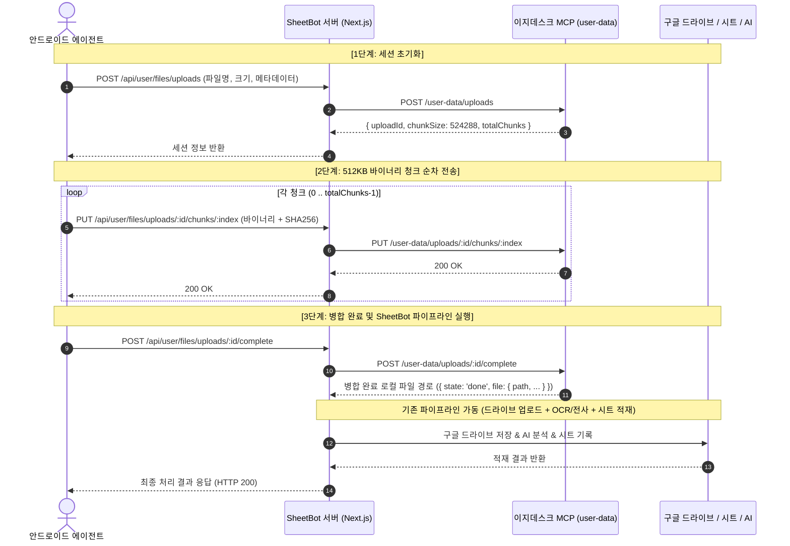

# 🚀 이지데스크 터널 안심 청크 분할 업로드(Tunnel-Safe Chunked Upload) 적용 계획서

본 문서는 `C:\EGDesk-Templates\egdesk-system-demo`의 청크 분할 업로드 표준 아키텍처를 **SheetBot 웹 서버** 및 **안드로이드 모바일 에이전트**에 도입하여, 터널링 환경(Render 프록시 등)에서 발생하는 **60초 게이트웨이 타임아웃(504 Gateway Timeout)** 및 **대용량 파일 전송 중단 문제**를 원천 차단하기 위한 사전 수정 계획서입니다.

---

## 1. 도입 배경 및 목표

1. **현상 및 문제점**:
   - 스마트폰에서 통화 녹음(수 MB ~ 수십 MB), 고화질 사진, 대용량 문서를 단일 Base64 JSON(`POST /api/user/files/upload`)으로 전송할 때, 외부 터널 프록시의 버퍼링 및 60초 소켓 타임아웃 제한으로 인해 서버에 도달하기 전 또는 응답 도중 연결이 강제 종료되는 문제 발생.
2. **해결 목표**:
   - `egdesk-system-demo`에서 검증된 **512KB 바이너리 청크 분할 전송 표준**을 적용.
   - 단일 청크당 0.1~0.3초 내 전송 완료로 60초 터널 타임아웃 위험을 100% 제거.
   - 네트워크 단절 시 실패한 청크만 재시도하는 고신뢰성 업로드 파이프라인 구축.
   - 기존 구글 드라이브 자동 보관함 및 AI OCR(명함/영수증), 통화 녹음 전사, 구글 시트 대장 적재 파이프라인과의 완벽한 유기적 연결.

---

## 2. 청크 업로드 3단계 표준 프로토콜 (`egdesk-system-demo` 기반)

---

## 3. 수정 대상 파일 및 상세 수정 계획

### A. 백엔드 (Next.js Web App: `src/app/api/user/files/`)

#### 1) `src/app/api/user/files/uploads/route.ts` & `_proxy.ts` (세션 초기화)
- **역할**: 클라이언트의 업로드 요청을 받아 MCP 업로드 세션을 발급받고, SheetBot 비즈니스 메타데이터를 저장.
- **수정 내용**:
  - `POST` 핸들러에서 파일 기본 정보(`filename`, `size`, `mimeType`) 외에 SheetBot 확장 메타데이터 수신:
    - `userEmail`: 로그인 세션 또는 요청자 이메일
    - `folderName`: 구글 드라이브 대상 폴더 (`[SheetBot] 통화 녹음`, `[SheetBot] 명함 보관함` 등)
    - `ocrType`: `GENERIC`, `BUSINESS_CARD`, `RECEIPT`
    - `memo`: 파일 설명 메모
    - `autoRecordSheet`: 시트 자동 적재 여부
    - `deviceId`: 모바일 기기 정보
    - `contactName`, `callTime`: 통화 녹음 전용 메타데이터
  - `uploadSessions` 인메모리/캐시 맵에 `uploadId`를 키로 메타데이터 보관.
  - MCP `/user-data/uploads` 호출 시 `forceStorageType: 'filesystem'` 전달.

#### 2) `src/app/api/user/files/uploads/[id]/chunks/[index]/route.ts` (청크 전송)
- **역할**: 512KB 바이너리 청크 수신 및 MCP 전달.
- **수정 내용**:
  - 요청 본문(`request.arrayBuffer()`)을 MCP `/user-data/uploads/:id/chunks/:index`로 무손실 바이너리 프록시 전송(`proxyRaw`).
  - `x-chunk-sha256` 헤더 전달을 통한 청크 무결성 검증.

#### 3) `src/app/api/user/files/uploads/[id]/route.ts` (세션 상태 조회 / 중단)
- **역할**: 대용량 비동기 조립 시 상태 폴링 및 중단 처리.
- **수정 내용**:
  - `GET`: MCP `/user-data/uploads/:id` 상태 조회 프록시.
  - `DELETE`: 업로드 세션 취소 시 임시 청크 및 메타데이터 정리.

#### 4) `src/app/api/user/files/uploads/[id]/complete/route.ts` (병합 완료 및 SheetBot 처리)
- **핵심 역할**: 파일 조립 완료 후, 디스크에 생성된 완성 파일을 가지고 기존 SheetBot 업로드 비즈니스 로직(드라이브 저장, 명함/영수증 OCR, 시트 적재)을 순차 실행.
- **수정 내용**:
  - MCP `POST /user-data/uploads/:id/complete` 호출.
  - 응답으로 조립된 로컬 임시 파일 경로(`result.file.path`) 획득.
  - 1단계에서 저장해둔 세션 메타데이터(`userEmail`, `folderName`, `ocrType` 등) 복원.
  - 기존 `src/app/api/user/files/upload/route.ts`의 공통 비즈니스 함수(`processUploadedFile`)로 파일 버퍼/스트림 전달:
    - 구글 드라이브 해당 폴더로 업로드 (`uploadDriveFileWithBridge`)
    - 명함/영수증 AI OCR 실행 및 비동기 작업 등록 (`callAiCaller` / `callAiBatchSubmit`)
    - 구글 스프레드시트 대장 실시간 행 추가 (`appendSheetRowWithFormat`)
  - 최종 성공 결과(`fileId`, `webViewLink`, `spreadsheetUrl`, `ocrData` 등)를 클라이언트에 응답.
  - 처리 완료 후 임시 파일 안전 회수.

#### 5) 기존 `src/app/api/user/files/upload/route.ts` (하위 호환성 유지)
- **수정 내용**:
  - 핵심 파일 처리 로직을 재사용 가능한 헬퍼(`processUploadedFile`)로 모듈화.
  - 구버전 앱이 보낸 단일 Base64 요청도 정상 작동하도록 기존 엔드포인트 100% 보존.

---

### B. 모바일 클라이언트 (Android: `android-user-agent/`)

#### 1) `ChunkedUploader.kt` (신규 파일: 청크 분할 업로드 전용 독립 엔진)
- **도입 사유**: `ApiClient.kt`의 비대화(현재 약 2,000라인)를 방지하고, 단일 책임 원칙(SRP) 및 유지보수성을 극대화하기 위해 청크 전송 전용 독립 싱글톤 매니저로 구현.
- **핵심 역할 및 기능**:
  - OkHttp 기반의 512KB 바이너리 청크 분할 전송 전담 엔진.
  - `uploadFileChunked(...)`:
    - 1단계 [세션 발급]: `POST /api/user/files/uploads` 호출하여 `uploadId`, `chunkSize(기본 512KB)` 획득.
    - 2단계 [청크 분할 전송]: 파일을 스트림/바이트 단위로 512KB씩 읽으며 `PUT /api/user/files/uploads/:id/chunks/:index` 전송.
      - 바이너리 바디(`RequestBody.create("application/octet-stream".toMediaType(), chunkBytes)`)
      - 청크별 SHA-256 해시 계산 후 `x-chunk-sha256` 헤더 탑재.
      - 청크 전송 실패 시 최대 3회 지수 백오프(Exponential Backoff: 1s, 2s, 4s) 자동 재시도.
      - 진행률(Progress Callback) 지원.
    - 3단계 [병합 및 완료]: `POST /api/user/files/uploads/:id/complete` 호출하여 병합 및 최종 결과 수신.
  - 전용 결과 데이터 클래스 정의 (`ChunkedUploadResult`).

#### 2) `ApiClient.kt` (인터페이스 유지 및 안전 폴백 브릿지)
- **수정 내용**:
  - `uploadGenericFile` 및 `uploadCallRecording` 내부에서:
    - 1차적으로 `ChunkedUploader.uploadFileChunked(...)`를 호출하여 안전하게 전송.
    - 만약 구버전 서버 접속이나 일시적 오류 발생 시 기존의 단일 Base64 전송으로 안전하게 자동 폴백(2단 안전망).
  - 기존 호출부(`FileUploadManager.kt`, `CallRecordingManager.kt`)의 코드 변경을 최소화하여 회귀 버그 원천 차단.

#### 3) `FileUploadManager.kt` & `CallRecordingManager.kt`
- **수정 내용**:
  - 고화질 사진 압축 룰(1600px 리사이즈)을 유지하여 청크 전송 효율 극대화.
  - 대용량 통화 녹음 파일도 청크 업로드를 통해 타임아웃 없이 안정적으로 처리되도록 로깅 보강.

---

## 4. 하위 호환성 및 안전장치

1. **이중 안전망 (Zero-Downtime Fallback)**:
   - 신규 청크 분할 업로드를 1순위로 시도하되, 구버전 서버 접속이나 네트워크 프로토콜 문제 발생 시 기존 `uploadGenericFile` / `uploadCallRecording` (Base64 단일 전송)으로 자동 폴백되도록 2단 안전망 구축.
2. **15초 멱등성(Idempotency) 및 동시 진행 락 유지**:
   - 백엔드의 `recentFileUploads` 및 `inFlightUploads` 캐시를 유지하여 동일 파일의 중복 업로드 및 시트 중복 기록 원천 방지.
3. **무결성 검증**:
   - 각 청크마다 SHA-256 검증을 수행하여 터널 전송 중 바이트 왜곡이나 유실을 즉시 감지하고 재전송.

---

## 5. 작업 진행 단계

1. **[사용자 사전 컨펌]**: 본 계획서 검토 및 승인.
2. **[1단계: 백엔드 모듈화 및 청크 API 구현]**:
   - `src/app/api/user/files/uploads/` 내 4개 엔드포인트 정비 및 비즈니스 로직 연동.
   - 로컬 테스트 스크립트로 청크 분할 업로드 및 드라이브/시트 연동 단위 검증.
3. **[2단계: 안드로이드 `ChunkedUploader.kt` 신규 생성 및 브릿지 연동]**:
   - `ChunkedUploader.kt` 단독 신규 생성 (512KB 청크 분할, SHA-256 검증, 재시도, OkHttp 스트림 전송).
   - `ApiClient.kt`의 기존 업로드 메서드에서 `ChunkedUploader`를 우선 호출하고 실패 시 자동 폴백하도록 브릿지 구성.
4. **[3단계: 통합 빌드 및 프로덕션 배포]**:
   - Next.js 프로덕션 빌드 & 이지데스크 SSL 서버 재기동.
   - 안드로이드 APK 빌드 및 다운로드 링크 동기화.
5. **[4단계: 실제 단말기 현장 검증]**:
   - 통화 녹음 파일 및 사진 청크 업로드 실측 (터널 타임아웃 없이 100% 정상 수신 검증).

---

위 계획에 대해 검토해 주시고, 수정 또는 보완할 사항이 있으시면 말씀해 주시기 바랍니다. 컨펌해 주시면 즉시 코드 구현에 착수하겠습니다!
